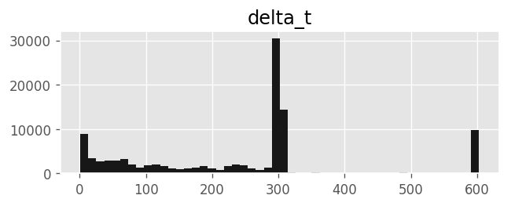

```python
# ATTENTION: Run this cell first to appreciate the wonders of good typography!
from IPython.core.display import HTML
HTML(open("custom_styles.css", "r").read())
```


<link href='http://fonts.googleapis.com/css?family=Fenix' rel='stylesheet' type='text/css'>
<link href='http://fonts.googleapis.com/css?family=Alegreya+Sans:100,300,400,500,700,800,900,100italic,300italic,400italic,500italic,700italic,800italic,900italic' rel='stylesheet' type='text/css'>
<link href='http://fonts.googleapis.com/css?family=Source+Code+Pro:300,400' rel='stylesheet' type='text/css'>
<style>

    .left {
        float: left;
        border: 0px solid #BDBDBD;
        background: #FFF;
        padding: 0px;
        margin:5px;
    }

    .right {
        float: right;
        width: 200px;
        border: 0px solid #BDBDBD;
        background: #FFF;
        padding: 5px;
        margin:5px;
    }

    figcaption{
    text-align:center;
    }

    div.cell{
        width:800px;
        margin-left:10% !important;
        margin-right:auto;
    }
    h1 {
        font-family: "Helvetica Neue",Helvetica,Arial,sans-serif;
    }
    h2 {
        font-family: "Helvetica Neue",Helvetica,Arial,sans-serif;
    }
    h3{
		font-family: "Helvetica Neue",Helvetica,Arial,sans-serif;
        margin-top:12px;
        margin-bottom: 3px;
       }
	h4{
		font-family: "Helvetica Neue",Helvetica,Arial,sans-serif;
       }
    h5 {
        font-family: "Helvetica Neue",Helvetica,Arial,sans-serif;
    }	   
    div.text_cell_render{
        font-family: "Helvetica Neue",Helvetica,Arial,sans-serif;
        color: #222; 
        line-height: 150%;
        font-size: 120%;
        width:600px;
        margin-left:auto;
        margin-right:auto;
    }
    .CodeMirror{
            font-family: "Source Code Pro", "Menlo", "Monaco", monospace;
			font-size: 100%;
    }
/*    .prompt{
        display: None;
    }*/
    .text_cell_render h1 {
        font-weight: 200;
        font-size: 30pt;
		line-height: 100%;
        color:#CD2305;
        margin-bottom: 0.5em;
        margin-top: 0.5em;
        display: block;
    }	
    .text_cell_render h5 {
        font-weight: 300;
        font-size: 16pt;
        color: #CD2305;
        font-style: italic;
        margin-bottom: .5em;
        margin-top: 0.5em;
        display: block;
    }
    
    .warning{
        color: rgb( 240, 20, 20 )
        }  
</style>


<a id='beginning'></a>
# Where people stay - extracting destinations from GPS data
<p> Author: [Sebastian Bertoli](https://www.sebastianbertoli.net) <br> Date: 01.01.2018</p>

## Introduction

This notebook showcases some of the work completed during my summer internship at the [Bruno Kessler Foundation](https://www.fbk.eu/en/). My responsibility was to find and implement an efficient algorithm that could, using GPS data, tell us where people had stayed for a pre-determined amount of time. So called stop-locations.

To extract stop-locations from GPS data I implemented and tested two algorithms: [ST-DBSCAN](https://www.sciencedirect.com/science/article/pii/S0169023X06000218) and an algorithm proposed by Kentaro and Toyama in [[1]](#hariharan2004). The focus of this notebook will be the latter.

### Outline
This notebook is structured as follows. First, we load and explore dataset I prepared for this experiment. Second, we process it and extract its stop locations. Third, we proceed with clustering the stop locations into so-called destinations (more on this later). Finally, we plot the results. (TODO: Compute statistics?) In short:

1. [Exploring the dataset](#eda)
1. [Extracting the users' stop locations](#extract_stops)
1. [Clustering the locations into destinations](#cluster_stops)
1. [Plotting the results](#calculate_rgyration)

**Note**: Most functions and plots are loaded from the accompanying `lachesis.py` and `plotly_helpers.py` files to avoid overloading this notebook with code. [Final thoughts](#finalthoughts), [acknowledgments](#acknowledgments) and [references](#references) can be found at the bottom.

<a id='eda'></a>
## Exploring the Data 
The proliferation of smartphones with GPS sensors has allowed to capture peoples movements in regular time intervals and at large scale. Once the data is collected, it can be further processed for research purposes. The unprocessed data typically consists of a timestamp, some type of identifier and longitude-latitude coordinates.

Foe the experiments we will use a random sample of the [T-Drive trajectory data sample](https://www.microsoft.com/en-us/research/publication/t-drive-trajectory-data-sample/). It contains one-week trajectories of 100 taxis in Bejing.

*Note:  If you prefer to use your own data you can do so, just make sure it is structured in the same way as the sample dataset.*

Without further adue let us load and explore the data!


```python
import pandas as pd
import matplotlib as mpl
import matplotlib.pyplot as plt
import plotly
from plotly_helpers import *  # Plot specifications
from lachesis import *  # Stop detection implementations
```


```python
# Various notebook settings
# plotly.offline.init_notebook_mode()
# plotly.init_notebook_mode()
%load_ext autoreload
%autoreload 2
%matplotlib inline
mpl.rcParams['figure.dpi'] = 120
plt.style.use('ggplot')
```


```python
df = (pd.read_csv("data/df_sample.csv", parse_dates=["timestamp"])
      .sort_values(['user_id', 'timestamp']))
print(df.iloc[:3,:], 
      "\n\nNumber records:", df.shape[0],
      "\nNumber users:", len(df["user_id"].unique()))
```

           user_id           timestamp  longitude  latitude
    48013      165 2008-02-02 13:46:16  116.49889  39.92208
    48014      165 2008-02-02 13:56:16  116.48131  39.92130
    48015      165 2008-02-02 14:06:15  116.42837  39.90675 
    
    Number records: 111712 
    Number users: 100


As we can see our sample dataset contains of 111,712 records coming from 100 different users. Each record has a `user_id` identifying the user, a `timestamp` and a `longitude` as well as `latitude` value. 

One important property of GPS data is the time elapsed between subsequent observations denoted as $\delta t$. Let's quickly calculate it and plot its distribution.


```python
df_stats = pd.DataFrame()
df_stats['delta_t'] = (df.groupby('user_id')['timestamp']
                       .transform(lambda x: x.diff()) / np.timedelta64(1,'s'))
delta_t_plot = (df_stats[df_stats['delta_t'] < df_stats['delta_t']
                .quantile(.96)]
                .hist(bins=50, figsize=(6,2), alpha=.9, color="black"))
```





We observe that for most records (96th percentile) the time lapsed between subsequent recordings is within 310 seconds. This gives us sufficient granularity to run our stop-detection algorithms on this dataset. 

Now let us get a better idea of the data by plotting a random sample on a map. We use the popular [Plotly library](https://plot.ly) for this. The plot is fully interactive so feel free explore the data on the map. 


```python
fig_datsample = plot_datasample(df.sample(df.shape[0]//20, random_state=10))
py.iplot(fig_datsample, filename='fig_datsample')
```


<iframe id="igraph" scrolling="no" style="border:none;" seamless="seamless" src="https://plot.ly/~public.sebastian/11.embed" height="340px" width="680px"></iframe>


